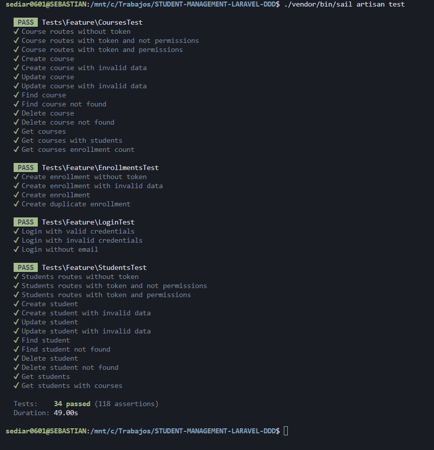

## Acerca del proyecto

Este proyecto es una API RESTful versionada para la gestión de cursos y estudiantes, aplicando Laravel 12, bajo el enfoque DDD.

## Tecnologías y paquetes principales

- Laravel 12
- MySql
- Redis
- Pest
- Laravel Sail
- Laravel Sanctum
- Spatie Permission

## Instalación, configuración y ejecución en entorno local

1. Clonar el repositorio
2. Copiar el archivo `.env.example` a `.env`
3. Configurar las variables de entorno y la base de datos
4. Ejecutar `composer install`
5. Ejecutar `php artisan key:generate`
6. Ejecutar `php artisan migrate --seed`
7. Ejecutar `php artisan serve`

## Instalacion, configuracion y ejecucion en sail (docker)

1. Clonar el repositorio
2. Copiar el archivo `.env.example` a `.env`
3. Configurar las variables de entorno y la base de datos
4. Ejecutar `composer install`
5. Ejecutar `php artisan key:generate`
6. Ejecutar `./vendor/bin/sail up` 
	- Si estás en Windows, descarga wsl y docker desktop para poder ejecutar el comando anterior.
	- Si estás en Windows, asegurate de que en docker desktop tengas habilitado el WSL y Ubuntu.
	- Si estás en Linux o Mac, asegurate de tener docker instalado y funcionando.
7. Ejecutar `./vendor/bin/sail artisan migrate --seed`
8. Ejecutar `./vendor/bin/sail artisan serve`

## Documentación

La documentación de la API fue realizada con Scramble Scramble – Laravel OpenAPI Documentation Generator.

Para acceder a la documentación, debes visitar la url `http://localhost:80/docs/api`

# Realización de pruebas

Para probar la API, puedes usar Postman con la colección que se encuentra en la raiz del proyecto o puedes usar la interfaz de la documentación.

# Covertura de test

El proyecto fue testeado con Pest.

Para ejecutar los tests, debes ejecutar el comando `php artisan test` o `./vendor/bin/sail artisan test` si estás usando sail.

# Autor

- [@sediar0627](https://github.com/sediar0627)

# Licencia

Este proyecto está bajo la licencia MIT.